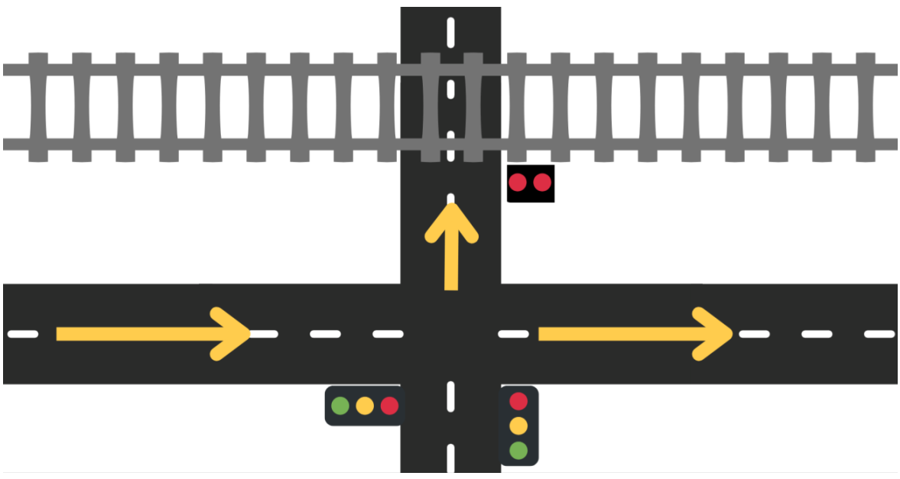
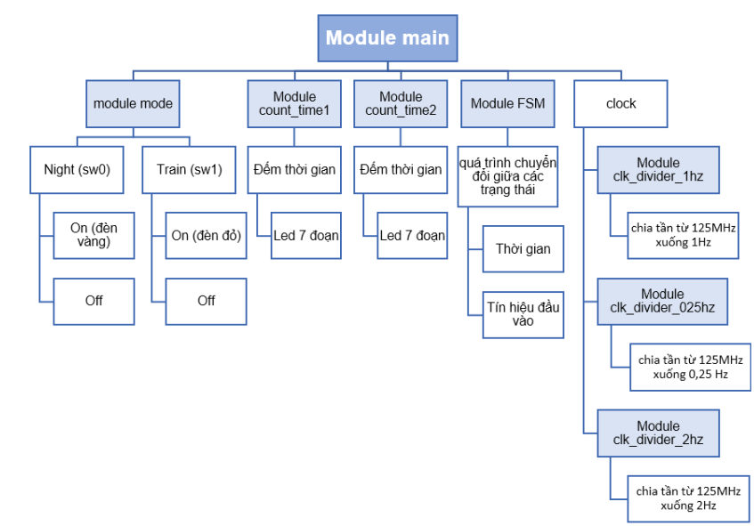
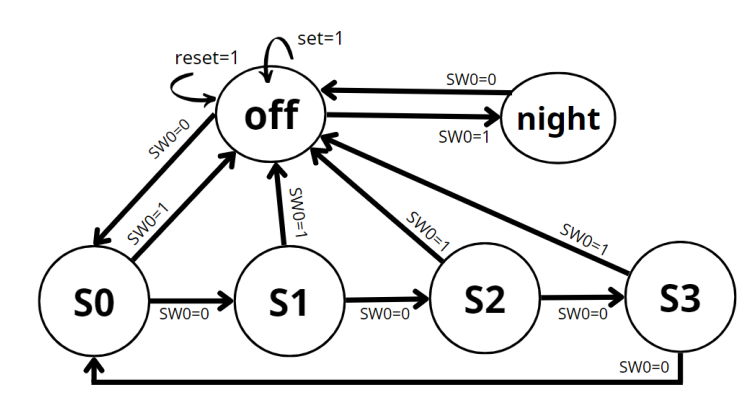
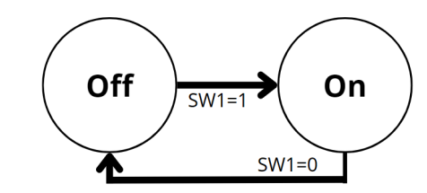

<h1> FSM Traffic Light With FPGA

## OVERVIEW
In our group's project, we simulate a traffic light which nears railway with four main functions, including: normal operation, time adjustment, night mode, and manual control to control traffic light when the train occurs.

This project used Digilent Arty Z7-20 with Verilog.

 

## MODULE:
 

## FSM:
<h3>For Traffic Light:</h3>
 

<h3>For Train:</h3>
 
